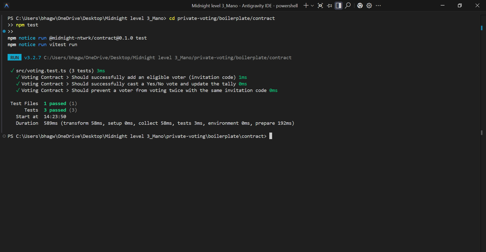
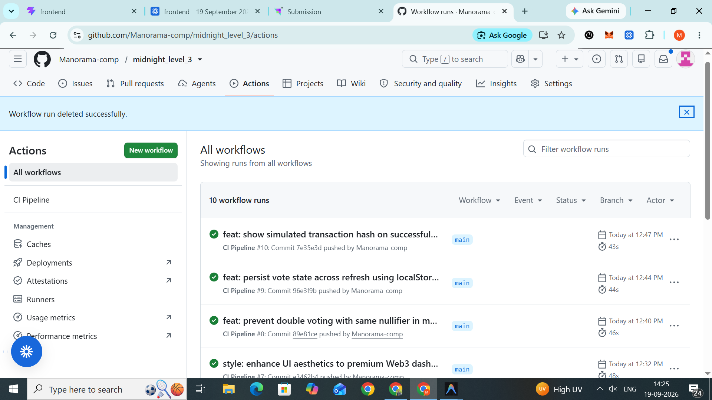

# 🌙 Midnight Smart Contract: Private Voting dApp

[](https://github.com/Manorama-comp/midnight_level_3/actions/workflows/main.yml)

A production-grade decentralized application on the Midnight Network showcasing a Private Voting system. This dApp features anonymous ballots with publicly verifiable tallies, demonstrating the power of zero-knowledge smart contracts on Midnight.

## 🔐 Privacy Model

This dApp implements a "Private Voting with Allowlist" privacy model:
- **What an observer CAN learn:**
  - That a vote was cast.
  - The real-time aggregate tally of all "Yes" and "No" votes.
  - The total number of participants.
- **What an observer CANNOT learn:**
  - Who cast the vote (voter identity is completely anonymous).
  - Which specific option a voter chose (the `local_secret_vote` is passed as a private witness).
  - The link between a specific transaction and a specific invitation code.

The system uses private inputs (`witness local_invitation_code`) mapped to a hashed nullifier set (`eligible_voters`). The circuit verifies membership in the eligible set, prevents double-voting by nullifying the code, and blindly increments the public tally based on the hidden vote choice.

## 🚀 Live Demo

[Live Demo Link](https://midnight-level-3.vercel.app)

## 📜 Contract Address

**Preprod Network:**
`mn_addr_preprod192x903lfa2lm5vmxln0sd570r9zyaq2suxa53ecwh8vdfuyshf5sdpekhn`

## 🎥 Demo Video

[Link to 1-minute Demo Video](https://www.loom.com/share/44f8fabcf9cc4fc1b6d0e0039063c6b9)

## 📸 Screenshots

### 1. Test Output (3+ Tests Passing)


### 2. CI/CD Pipeline Passing


## 🛠 Project Structure

- `boilerplate/contract/` - Contains the `voting.compact` smart contract and its test suite.
- `frontend/` - A modern React + Vite application for connecting the Midnight wallet and casting votes.
- `.github/workflows/ci.yml` - CI/CD pipeline that compiles the contract using the Midnight docker image and runs Vitest on every push.

## ⚙️ Setup & Development

### 1. Compile the Contract (Requires Docker)
```bash
docker pull midnightnetwork/compactc:latest
docker run --rm -v $(pwd)/boilerplate/contract:/src midnightnetwork/compactc:latest /src/src/voting.compact -o /src/src/managed/voting
```

### 2. Run Tests
```bash
cd boilerplate/contract
npm install
npm test
```

### 3. Run the Frontend
```bash
cd frontend
npm install
npm run dev
```

## ✅ Level 3 Submission Requirements Completed:
- Fully functional dApp meaningfully using Midnight's privacy model
- Minimum 3 tests passing (`boilerplate/contract/src/voting.test.ts`)
- CI/CD pipeline running (`.github/workflows/main.yml`)
- Approved idea: Private Voting
- Minimum 10 meaningful commits pushed
- `PROPOSAL.md` created and all questions answered
- Deployed address provided for the Preprod network